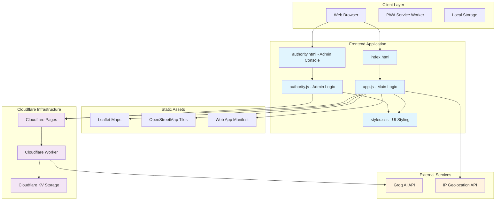
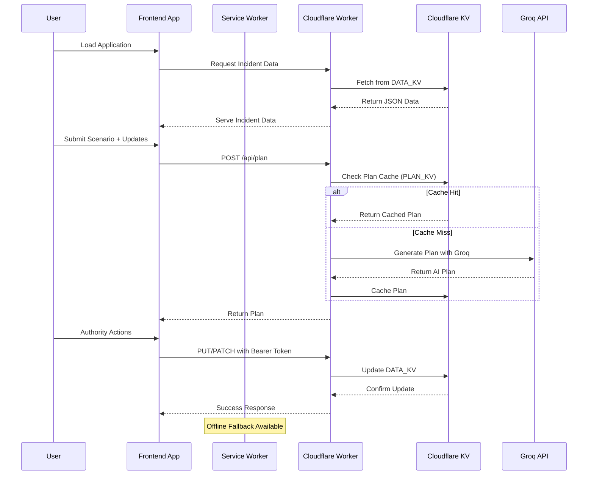
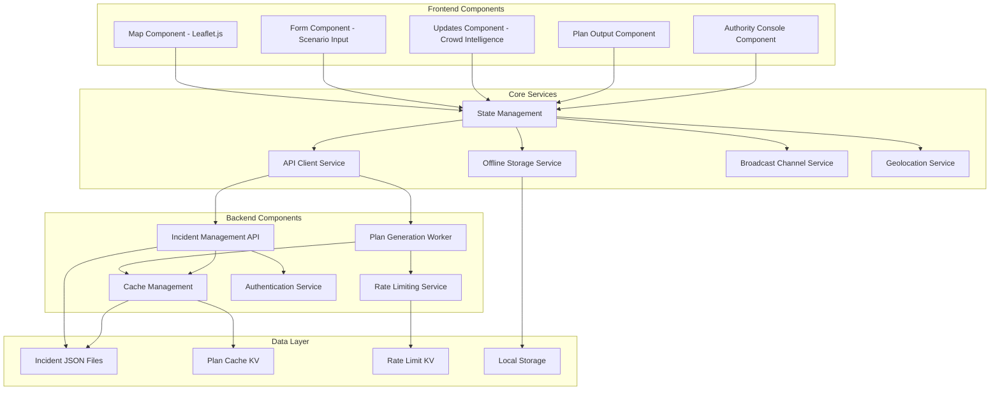

# RescueMind — Crowd-Sourced Disaster Response Planner

> Empowering communities to plan smarter, faster disaster responses with AI and crowd wisdom.

## Demo Video

[](https://youtu.be/mJnrux5U6EY)

*Watch the 3-minute demo to see RescueMind in action!*

## Table of Contents

- [Project Overview](#project-overview)
- [Problem Statement](#problem-statement)
- [Technical Architecture](#technical-architecture)
- [Technology Stack](#technology-stack)
- [Setup and Installation](#setup-and-installation)
- [Configuration Files](#configuration-files)
- [Dependencies](#dependencies)
- [Cost Analysis](#cost-analysis)
- [API Documentation](#api-documentation)
- [Development](#development)
- [Deployment](#deployment)
- [Security](#security)
- [Contributing](#contributing)
- [License](#license)

## Project Overview

RescueMind is a web-based disaster response planning platform that combines artificial intelligence with crowd-sourced intelligence to generate actionable response plans in real-time. The platform enables communities, emergency responders, and authorities to collaboratively create and update disaster response plans through an intuitive web interface.

### Key Features

- **Interactive Incident Map**: Visual representation of disaster incidents with Leaflet.js integration
- **Real-time Crowd Updates**: Community members can contribute ground-truth updates about changing conditions
- **AI-Powered Planning**: Integration with Groq's GPT-OSS models for intelligent plan generation
- **Authority Console**: Secure interface for incident curation and management
- **Offline-First Design**: Progressive Web App with Service Worker for offline functionality
- **Privacy by Default**: No user accounts required, all data stored locally or in secure KV storage

### Core Workflow

1. **Incident Selection**: Choose from existing incidents or create new ones on an interactive map
2. **Scenario Definition**: Input disaster type, affected population, available resources, and constraints
3. **Crowd Intelligence**: Community members contribute real-time updates about changing conditions
4. **AI Plan Generation**: System generates comprehensive response plans using advanced AI models
5. **Plan Execution**: Export plans as JSON or printable formats for coordination

## Problem Statement

### The Challenge
Natural disasters and emergencies require rapid, coordinated response planning. Traditional approaches suffer from several critical limitations:

- **Information Silos**: Emergency responders often lack real-time ground truth from affected communities
- **Delayed Planning**: Manual plan creation takes hours or days, when minutes matter
- **Resource Inefficiency**: Poor visibility into available resources and changing conditions
- **Coordination Gaps**: Limited ability to integrate crowd-sourced intelligence with expert planning
- **Infrastructure Dependency**: Many planning tools require reliable internet and complex infrastructure

### The Solution
RescueMind addresses these challenges through:

- **Crowd-Sourced Intelligence**: Real-time updates from community members on the ground
- **AI-Accelerated Planning**: Instant generation of comprehensive response plans using advanced language models
- **Offline-First Architecture**: Functional even in low-connectivity disaster zones
- **Static-First Deployment**: Deployable anywhere without complex infrastructure requirements
- **Privacy-Respecting Design**: No user data collection, secure by default

## Technical Architecture

### System Architecture Overview



### Data Flow Architecture



### Component Architecture



## Technology Stack

### Frontend Technologies
- **Core**: Vanilla JavaScript (ES6+), HTML5, CSS3
- **Maps**: Leaflet.js with OpenStreetMap tiles
- **Progressive Web App**: Service Worker API, Web App Manifest
- **UI Framework**: Custom CSS with modern design patterns
- **Real-time Communication**: BroadcastChannel API for cross-tab sync
- **Offline Support**: Cache API, IndexedDB for local storage

### Backend Technologies
- **Serverless Runtime**: Cloudflare Workers (V8 isolate-based)
- **Storage**: Cloudflare KV (key-value database)
- **AI Integration**: Groq API (GPT-OSS-20B/120B models)
- **Authentication**: Bearer token-based authorization
- **Caching**: Intelligent plan caching with content-based keys

### Development Tools
- **Build/Deployment**: Cloudflare Wrangler CLI
- **Version Control**: Git
- **Package Management**: npm (for development dependencies)
- **Testing**: Manual testing, browser developer tools
- **Documentation**: Markdown, Mermaid diagrams

### External Dependencies
- **Leaflet.js**: Interactive maps (CDN: `https://unpkg.com/leaflet@1.9.4/`)
- **OpenStreetMap**: Map tiles and geocoding
- **Groq API**: AI model inference for plan generation

## Dependencies

### Runtime Dependencies (CDN)
```html
<!-- Maps and UI -->
<script src="https://unpkg.com/leaflet@1.9.4/dist/leaflet.js"></script>
<link rel="stylesheet" href="https://unpkg.com/leaflet@1.9.4/dist/leaflet.css" />
```

### Development Dependencies
```json
{
  "devDependencies": {
    "wrangler": "^3.0.0"
  }
}
```

### System Requirements
- **Browser Support**: Modern browsers with ES6 support (Chrome 70+, Firefox 65+, Safari 12+)
- **Storage**: ~5MB for incident data and cached plans
- **Network**: Works offline with cached data, syncs when online
- **Permissions**: Geolocation API access for location features

## Cost Analysis

### Cloudflare Infrastructure Costs

RescueMind is designed to be cost-effective with a focus on Cloudflare's generous free tiers:

#### Free Tier (Recommended for Development/Testing)
- **Cloudflare Workers**: 100,000 requests/day free
- **Cloudflare KV**: 1GB storage, 10M operations/month free
- **Cloudflare Pages**: 100 GB bandwidth, unlimited static sites free
- **Groq API**: Pay-per-token pricing (varies by model)

#### Production Cost Estimate (Low-Traffic Scenario)
Based on typical disaster response usage patterns:

| Service | Free Tier Limits | Paid Tier (if exceeded) | Estimated Monthly Cost |
|---------|------------------|-------------------------|----------------------|
| **Workers** | 100K requests/day | $0.30/100K requests | $0-5 |
| **KV Storage** | 1GB free | $0.50/GB/month | $0-2 |
| **KV Operations** | 10M/month free | $0.50/1M operations | $0-1 |
| **Pages Bandwidth** | 100GB free | $0.15/GB | $0 |
| **Groq API** | N/A | $0.20/1M tokens (approx) | $5-20 |

**Total Estimated Monthly Cost**: **$0-28** for moderate usage

#### High-Traffic Disaster Scenario
During major disaster response (1000+ concurrent users):
- **Estimated Cost**: $50-200/month
- **Breakdown**: Primarily Groq API tokens for plan generation

### Cost Optimization Strategies
1. **Plan Caching**: Reduces AI API calls by caching generated plans
2. **Rate Limiting**: Prevents abuse and manages costs during high-traffic events
3. **Offline-First**: Reduces server load through client-side caching
4. **Static Assets**: No server-side rendering costs

### Cost Monitoring
- **Cloudflare Dashboard**: Real-time usage monitoring
- **KV Analytics**: Storage and operation metrics
- **Worker Metrics**: Request counts and performance data

## Setup and Installation

### Prerequisites
- Node.js 16+ (for Cloudflare Wrangler CLI)
- Git
- Modern web browser
- Groq API key (optional, for AI features)

### Quick Start (Local Development)

1. **Clone the repository**
   ```bash
   git clone <repository-url>
   cd rescuemind
   ```

2. **Install Cloudflare Wrangler (optional, for API development)**
   ```bash
   npm install -g wrangler
   ```

3. **Start local static server**
   ```bash
   # Using Python (built-in)
   python3 -m http.server 8000

   # Or using Node.js
   npx serve . -p 8000
   ```

4. **Open in browser**
   ```
   http://localhost:8000
   ```

5. **Test Authority Console**
   - Open `http://localhost:8000/authority.html`
   - Auth token loads automatically via API for authorized users
   - Create/edit incidents - changes should persist to the API

### API Development Setup

1. **Install Wrangler**
   ```bash
   npm install -g wrangler
   ```

2. **Configure environment**
   ```bash
   # Copy development environment template
   cp .dev.vars.example .dev.vars

   # Edit .dev.vars with your API keys
   nano .dev.vars
   ```

3. **Set API keys**
   ```bash
   # Set Groq API key
   echo "GROQ_API_KEY=your_groq_api_key_here" >> .dev.vars

   # Set authentication token for authority console
   echo "AUTH_TOKEN=your_secure_token_here" >> .dev.vars
   ```

4. **Start local development server**
   ```bash
   wrangler dev
   ```

5. **Configure frontend for API**
   ```html
   <!-- Add before app.js in index.html -->
   <script>
     window.__PLAN_API__ = 'http://127.0.0.1:8787/api/plan';
   </script>
   ```

### Production Deployment

See the [Deployment](#-deployment) section below for detailed production setup instructions.

## Configuration Files

### wrangler.toml
Main Cloudflare Workers configuration:
```toml
name = "rescuemind-plan-proxy"
main = "api/plan-worker.js"
compatibility_date = "2025-01-15"
compatibility_flags = ["nodejs_compat"]

[vars]
# Add non-secret defaults here if needed

[[kv_namespaces]]
binding = "PLAN_KV"
id = "your_plan_kv_namespace_id"

[[kv_namespaces]]
binding = "DATA_KV"
id = "your_data_kv_namespace_id"

[[kv_namespaces]]
binding = "RATE_KV"
id = "your_rate_kv_namespace_id"
```

### manifest.webmanifest
Progressive Web App configuration:
```json
{
  "name": "RescueMind - Disaster Response Planner",
  "short_name": "RescueMind",
  "description": "Crowd-sourced disaster response planning",
  "start_url": "/",
  "display": "standalone",
  "background_color": "#ffffff",
  "theme_color": "#0f172a",
  "icons": [
    {
      "src": "icon-192.png",
      "sizes": "192x192",
      "type": "image/png"
    }
  ]
}
```

### .dev.vars (Development Only)
```bash
# Groq API key for AI plan generation
GROQ_API_KEY=your_groq_api_key

# Bearer token for authority console authentication
AUTH_TOKEN=your_secure_auth_token
```

## API Documentation

### Plan Generation API

**Endpoint**: `POST /api/plan`

Generate an AI-powered response plan from scenario data and crowd updates.

**Request Body**:
```json
{
  "scenario": {
    "type": "flood",
    "location": "Downtown Riverside",
    "population": 5000,
    "resources": "2 ambulances, 50 volunteers",
    "constraints": "Limited road access"
  },
  "updates": [
    {
      "text": "Main bridge washed out",
      "ts": "2025-01-15T10:30:00Z",
      "resolved": false
    }
  ],
  "options": {
    "model": "gpt-oss-20b"
  },
  "incidentId": "flood-riverside-001"
}
```

**Response**:
```json
{
  "plan": {
    "summary": "Immediate evacuation plan for flood-affected area",
    "priorities": [
      "Evacuate Zone A immediately",
      "Deploy medical teams to staging areas",
      "Establish communication checkpoints"
    ],
    "resources": [
      "2 ambulances → Emergency staging area",
      "50 volunteers → Evacuation assistance"
    ],
    "timeline": "T+0: Evacuation, T+2hrs: Assessment, T+6hrs: Relief distribution"
  },
  "metadata": {
    "generated": "2025-01-15T10:35:00Z",
    "model": "gpt-oss-20b",
    "cached": false
  }
}
```

### Incident Management API

**List Incidents**: `GET /api/incidents`
**Get Incident**: `GET /api/incidents/{id}`
**Create/Update Incident**: `PUT /api/incidents/{id}` (Bearer auth required)
**Update Incident Updates**: `PATCH /api/incidents/{id}/updates` (Bearer auth required)

**Update Operations**:
```json
// Add new update
{
  "op": "add",
  "text": "Road blocked by debris",
  "ts": "2025-01-15T11:00:00Z"
}

// Resolve existing update
{
  "op": "resolve",
  "text": "Road blocked by debris",
  "ts": "2025-01-15T11:00:00Z",
  "resolved": true
}

// Delete update
{
  "op": "delete",
  "text": "Road blocked by debris",
  "ts": "2025-01-15T11:00:00Z"
}
```

### Data Access API

**Incident Data**: `GET /data/incidents/{filename}.json`
**Plan Cache**: `GET /data/plans/{id}.json`

## Development

### Project Structure
```
rescuemind/
├── api/
│   └── plan-worker.js          # Cloudflare Worker backend
├── data/
│   ├── incidents/              # JSON incident data files
│   └── sample_plans.json       # Example plan outputs
├── scripts/
│   └── sample-request.json     # API testing data
├── index.html                  # Main application
├── authority.html              # Authority console
├── app.js                      # Main application logic
├── authority.js                # Authority console logic
├── styles.css                  # Application styling
├── sw.js                       # Service worker
├── manifest.webmanifest        # PWA manifest
└── wrangler.toml              # Cloudflare config
```

### Development Workflow

1. **Local Development**
   - Use `python3 -m http.server 8000` for static files
   - Use `wrangler dev` for API development
   - Test in multiple browsers

2. **Code Quality**
   - Follow vanilla JS best practices
   - Use modern ES6+ features
   - Maintain clean, readable code structure
   - Add comments for complex logic

3. **Testing**
   - Manual testing across different scenarios
   - Test offline functionality
   - Validate API responses
   - Check cross-browser compatibility

### Adding New Features

1. **Frontend Features**
   - Add HTML structure to `index.html`
   - Implement logic in `app.js`
   - Add styling in `styles.css`
   - Update service worker if needed

2. **Backend Features**
   - Modify `api/plan-worker.js`
   - Update `wrangler.toml` for new bindings
   - Test with `wrangler dev`

## Deployment

### Production Setup

1. **Cloudflare Account Setup**
   ```bash
   # Login to Cloudflare
   wrangler auth login
   ```

2. **Create KV Namespaces**
   ```bash
   # Create namespaces for production
   wrangler kv:namespace create PLAN_KV
   wrangler kv:namespace create PLAN_KV --preview
   wrangler kv:namespace create DATA_KV
   wrangler kv:namespace create DATA_KV --preview
   wrangler kv:namespace create RATE_KV
   wrangler kv:namespace create RATE_KV --preview
   ```

3. **Configure Secrets**
   ```bash
   # Set API keys
   wrangler secret put GROQ_API_KEY
   wrangler secret put AUTH_TOKEN
   ```

4. **Seed Initial Data**
   ```bash
   # First, login to Cloudflare (if not already done)
   wrangler auth login

   # Upload incident data
   # Note: Use the correct binding name that matches your wrangler.toml
   wrangler kv:key put --binding=DATA_KV "data/incidents/index.json" --path data/incidents/index.json

   # Upload all incident files
   for f in data/incidents/*.json; do
     if [ "$f" != "data/incidents/index.json" ]; then
       key="data/incidents/$(basename "$f")"
       wrangler kv:key put --binding=DATA_KV "$key" --path "$f"
     fi
   done

   # Alternative syntax (try this if the above doesn't work):
   # wrangler kv key put data/incidents/index.json --binding=DATA_KV --path data/incidents/index.json

   # Verify data was uploaded
   wrangler kv:key list --binding=DATA_KV
   # or: wrangler kv key list --binding=DATA_KV
   ```

5. **Deploy Worker**
   ```bash
   wrangler deploy
   ```

6. **Deploy Frontend**
   - Create Cloudflare Pages project
   - Connect GitHub repository
   - Configure build settings (no build required)
   - Set custom domain (optional)

7. **Configure Routing**
   - Add Worker routes for `/api/*` and `/data/*`
   - Ensure same-domain deployment for CORS

### Environment Variables

**Production Configuration**:
```bash
# In Cloudflare Dashboard or wrangler secrets
GROQ_API_KEY=your_production_groq_key
AUTH_TOKEN=your_production_auth_token
```

**Custom Domain Setup**:
```html
<!-- For separate domains, configure before app.js -->
<script>
  window.__PLAN_API__ = 'https://your-worker.yourdomain.com/api/plan';
  window.__DATA_BASE__ = 'https://your-worker.yourdomain.com';
</script>
```

## Security

### Authentication & Authorization
- **Bearer Token**: Authority console operations require `Authorization: Bearer <token>` header
- **No User Accounts**: Privacy-first design with no personal data collection
- **API Key Protection**: Groq API key stored securely in Cloudflare environment

### Data Protection
- **Client-Side Processing**: Sensitive data never leaves user's browser
- **Secure Storage**: Cloudflare KV with encryption at rest
- **HTTPS Only**: All production deployments use HTTPS
- **CORS Policy**: Strict cross-origin resource sharing controls

### Authority Console Security
- **Access Control**: Protect `/authority` path with Cloudflare Access to control who can access the authority console
- **Automatic Authentication**: Authorized users get auth tokens automatically via protected `/api/auth-token` endpoint
- **Token Rotation**: Regularly rotate the AUTH_TOKEN secret in Cloudflare Worker settings
- **Audit Logging**: Worker logs all write operations for accountability

### AI Safety
- **Guardrails**: Built-in safety checks prevent harmful plan generation
- **Input Validation**: Sanitize all user inputs before AI processing
- **Fallback Mode**: Deterministic template fallback when AI unavailable

## Troubleshooting

### Authority Console Shows Offline Mode

If the authority console falls back to offline mode instead of connecting to the live API:

1. **Check API Endpoint**: Visit `https://rescuemind-plan-proxy.jakub-dunak.workers.dev/data/incidents/index.json` directly
   - If you get a 404, the data hasn't been uploaded to Cloudflare KV
   - If you see incident data, the API is working correctly

2. **Verify Data Upload**: Check if incident data has been seeded to Cloudflare KV:
   ```bash
   wrangler kv:key list --binding=DATA_KV
   ```
   You should see keys like `data/incidents/index.json` and `data/incidents/*.json`

3. **Browser Console Logs**: Open the authority console and check browser developer tools:
   - Look for `[Authority] Loading incidents from:` messages
   - If it says "falling back to offline mode", the API connection failed

4. **CORS Issues**: Ensure the authority console is served over HTTPS when accessing the workers.dev API

5. **Redeploy Worker**: If data was uploaded but API still returns 404:
   ```bash
   wrangler deploy
   ```

### Common Issues

- **"Failed to load manifest: 404"**: Incident data not uploaded to KV store
- **"CORS error"**: Mixed HTTP/HTTPS content or missing CORS headers
- **"Unauthorized"**: Missing or incorrect AUTH_TOKEN for write operations
- **"Command not found"**: Try alternative wrangler command syntax:
  - `wrangler kv:key put` vs `wrangler kv key put`
  - `wrangler kv:key list` vs `wrangler kv key list`
- **"Invalid binding"**: Ensure binding name matches exactly with `wrangler.toml`

## Contributing

### Development Guidelines
1. **Code Style**: Follow existing patterns and use modern JavaScript features
2. **Documentation**: Update README and code comments for significant changes
3. **Testing**: Manually test all features before submitting changes
4. **Security**: Review security implications of all changes

### Areas for Contribution
- **UI/UX Improvements**: Enhance user interface and experience
- **Additional AI Models**: Integrate other language models for plan generation
- **Internationalization**: Add support for multiple languages
- **Mobile Optimization**: Improve mobile device experience
- **Offline Features**: Enhance offline functionality and data synchronization

### Reporting Issues
- Use GitHub Issues for bug reports and feature requests
- Include browser, OS, and steps to reproduce
- Attach screenshots for UI-related issues

## License

**Creative Commons Attribution-NonCommercial 4.0 International (CC BY-NC 4.0)**

This work is licensed under the Creative Commons Attribution-NonCommercial 4.0 International License. To view a copy of this license, visit http://creativecommons.org/licenses/by-nc/4.0/ or send a letter to Creative Commons, PO Box 1866, Mountain View, CA 94042, USA.

---

Built for communities in crisis.

For questions or support, please open an issue on GitHub.
